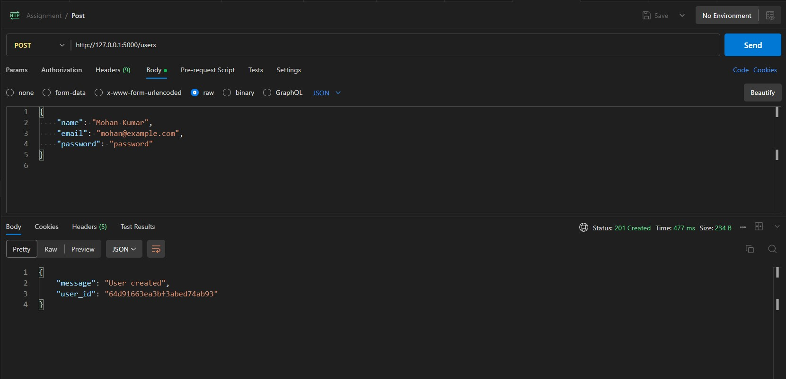
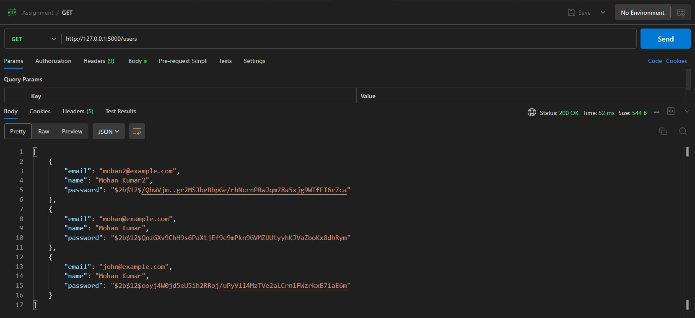
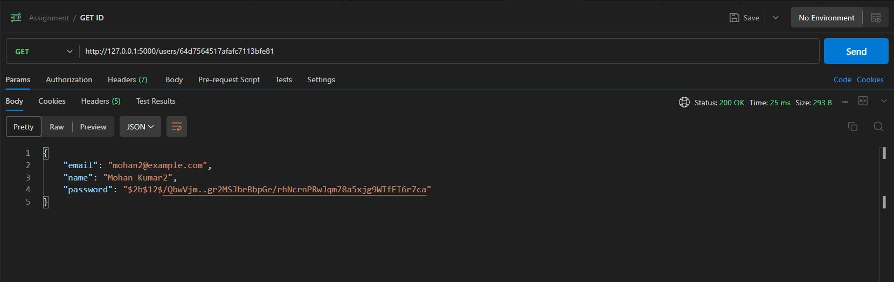
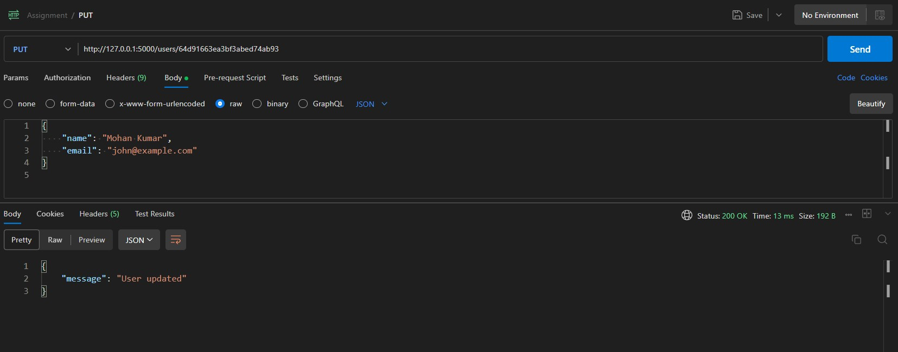
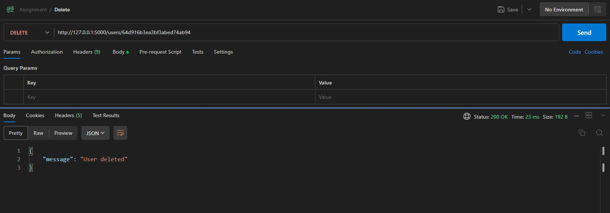

# Flask CRUD API with MongoDB

This project implements a Flask application that provides a REST API for performing CRUD (Create, Read, Update, Delete) operations on a User resource using a MongoDB database. The project allows HTTP requests to interact with the API endpoints and includes a Postman collection for testing.

## Directory Structure

```

.
├── Dockerfile
├── README.md
├── app.py
├── docker-compose.yml
├── docs
│   └── Assignment.postman_collection.json
└── requirements.txt

```

- `Dockerfile`: Docker configuration for containerizing the application.
- `app.py`: Flask application code implementing the CRUD API.
- `docker-compose.yml`: Configuration for setting up multiple containers.
- `docs`: Directory containing documentation files.
- `docs/Assignment.postman_collection.json`: Postman collection for testing the API.
- `requirements.txt`: List of project dependencies.

## Dependencies

- Python 3.11
- MongoDB
- Required Python packages are listed in `requirements.txt`.

## Setup and Run

1. Install Docker and Docker Compose on your system.
2. Clone this repository.

```bash
git clone https://github.com/Zoronium/Flask-Mongo-project.git
cd Flask-Mongo-project
```

if Not Using Docker [ or manually setting up ]

3. Rename `.envsample` to `.env` and update configuration variables.

4. Build and start the application using Docker Compose.

```bash
docker-compose up -d
```

5. Access the API using HTTP requests or test it using the provided Postman collection.

You can now access the API endpoints by sending HTTP requests to the appropriate URLs. Use the provided Postman collection (docs/Assignment.postman_collection.json) to test the API's functionality.

## Usage

most of the requests are in the [POSTMAN EXPORT File](./docs/Assignment.postman_collection.json)

### Create User / POST

Send a POST request to /users with user details in the request body to create a new user.

```http
POST /users HTTP/1.1
Host: 127.0.0.1:5000
Cache-Control: no-cache
Content-Type: application/json
{
    "name": "John Doe",
    "email": "john@example.com",
    "password": "secret"
}
```



### Read User / GET

Send a GET request to /users/ to retrieve details of all user.

```http
GET /users HTTP/1.1
Host: 127.0.0.1:5000
Cache-Control: no-cache
Content-Type: application/json

```



Send a GET request to /users/{user_id} to retrieve details of a specific user.

```http
GET /users/<USERID> HTTP/1.1
Host: 127.0.0.1:5000
Cache-Control: no-cache
Content-Type: application/json

```

<br/>



### Update User

Send a PUT request to /users/{user_id} with updated user details in the request body to update a user.

```http
PUT /users/<USERID> HTTP/1.1
Host: 127.0.0.1:5000
Cache-Control: no-cache
Content-Type: application/json

{
    "name": "Mohan Kumar",
    "email": "john@example.com"
}
```



### Delete User

Send a DELETE request to /users/{user_id} to delete a user.

```http
DELETE /users/<USERID> HTTP/1.1
Host: 127.0.0.1:5000
Cache-Control: no-cache

```



## About the Author

This project was developed by [Advait Jain](https://www.linkedin.com/in/advaitj/).

You can find more about me on my [GitHub profile](https://github.com/zoronium) and connect with me on [LinkedIn](https://www.linkedin.com/in/advaitj/).

Feel free to reach out if you have any questions or suggestions!
